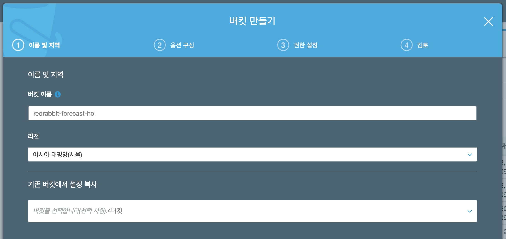
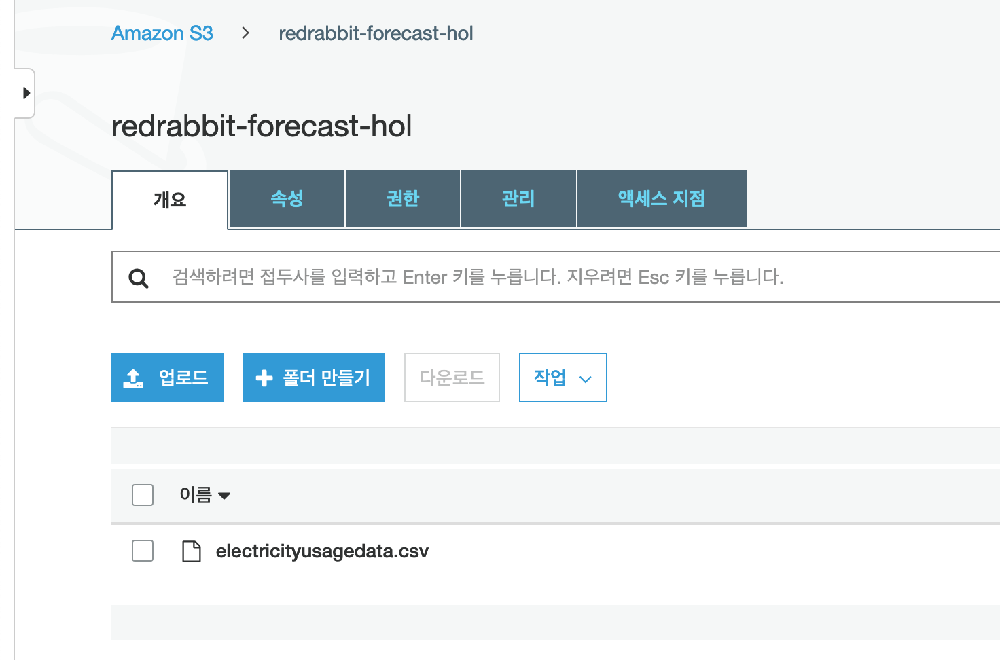

# 훈련 데이터 준비

본 실습에서는 공식 개발자 안내서에서 사용하는 것과 같은 데이터를 사용하여 훈련[^1]합니다.

[^1]:  AWS 공식 문서에서는 'training data'를 '교육 데이터'로 번역하고 있습니다.
  이것이 틀린 표현이라고 생각하지는 않습니다. 하지만, '교육'보다는 '훈련'이 더 나은 번역이라고 봅니다.
  '교육'은 협의로 학교 교육만 지칭할 수도 있고 광의로는 사회생활에 필요한 지식과 기술 그리고 인간의 잠재
  능력을 일깨워 이끄는 행위를 말합니다. 반면, '훈련'은 일정한 목표나 기준에 도달할 수 있도록 하는
  실제적 확동을 뜻하는 것입니다.  
  아직은 우리가 이용하고 만들고 있는 AI/ML에게 '교육'이라는 말을 쓰는 것보다, '훈련'이라는 말을
  대입하는 것이 여러 관점에서 옳다는 판단입니다.

## 준비 단계

1. 훈련 데이터 다운로드
2. S3 버킷 생성
3. 훈련 데이터 생성한 S3 버킷에 업로드
4. IAM role 작성

의 순서로 진행됩니다.  
Amazon Forecast는 2020-05-20 현재, 훈련 데이터는 Amazon S3를 통해서만 가져올 수 있게 되어 있습니다.
그리고 훈련 데이터는 모두 CSV 포멧이어야 합니다. 그래서 우리는 CSV 포멧의 시계열 데이터를 S3 버킷에 올려 둘 것입니다. 그리고 Amazon Forecast가 버킷에 접근할 수 있게 권한 설정도 할 것입니다.

### 훈련 데이터 다운로드

훈련 데이터 다운로드: [electricityusagedata.zip](https://docs.aws.amazon.com/forecast/latest/dg/samples/electricityusagedata.zip) 왼쪽의 링크로 해당 데이터를 다운로드 합니다.

!!! info ""
    AWS [공식 개발자 안내서](https://docs.aws.amazon.com/forecast/latest/dg/getting-started.html#gs-upload-data-to-s3)에서는 다음과 같이 훈련 데이터에 대한 설명이 있습니다.
    For this exercise, you use the individual household electric power consumption dataset. (Dua, D. and Karra Taniskidou, E. (2017). UCI Machine Learning Repository [http://archive.ics.uci.edu/ml](http://archive.ics.uci.edu/ml). Irvine, CA: University of California, School of Information and Computer Science.) We aggregate the usage data hourly.  
    본 실습에서 유용한 정보는 'data hourly' 즉, '한 시간 단위의 계측치'라는 것입니다.
    이 부분은 '대상 시계열 데이터'를 선언하는 데에 사용됩니다.

다운로드한 데이터는 압출을 해제해 놓습니다. 압축을 해제하면 electricityusagedata.csv 라는 파일이
압축 파일이 있는 곳과 같은 디렉토리에 생성됩니다.

### S3 버킷 생성

S3는 [console.aws.amazon.com/s3](https://console.aws.amazon.com/s3)로 접속하면
된다는 것 즈음은 모두가 알고 있을 것입니다. 접속해서, 사용할 버킷을 생성합니다. 버킷 이름을 정하는 것
이외에는 모두 기본값으로 두어도 무관합니다.

### 훈련 데이터 업로드

앞서 압축을 해제해서 얻은 파일, electricityusagedata.csv 을 해당 버킷에 업로드합니다.
폴더를 만들어서 그곳에 올려도 그냥 올려도 상관없습니다.

### IAM Role 작성

지금 준비하지 않아도 괜찮습니다. 데이터-셋 그룹을 작성하는 단계에서 간단히 끝낼 수 있습니다. 하지만,
보다 상세하게 알고 싶고 && 지금 당장 이 부분을 해결하고 싶다면 다음의 링크를 따라
공식 개발자 안내서를 참조하면 되겠습니다.  
[Amazon forecast에 대한 권한 설정](https://docs.aws.amazon.com/ko_kr/forecast/latest/dg/aws-forecast-iam-roles.html)
