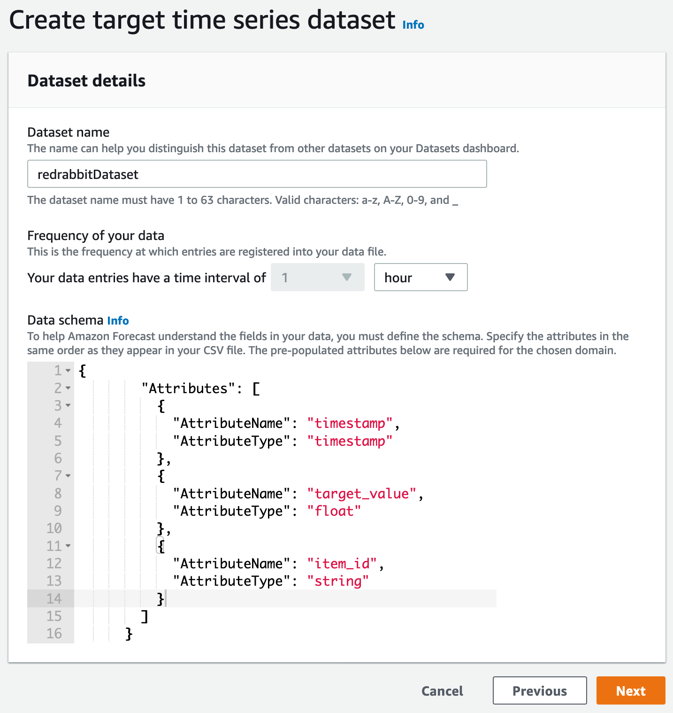

# 대상 시계열 데이터-셋 생성

총 3단계로 안내되는 데이터-셋 그룹 작성의 과정에서 두 번재에 해당됩니다.  
여기에서 가장 중요한 부분은 **데이터 스키마**(Data schema)를 확정하는 것인데,
기본값은 아래와 같습니다.

```json
{
        "Attributes": [
          {
            "AttributeName": "item_id",
            "AttributeType": "string"
          },
          {
            "AttributeName": "timestamp",
            "AttributeType": "timestamp"
          },
          {
            "AttributeName": "target_value",
            "AttributeType": "float"
          }
        ]
      }
```

지난 단계에서 다운로드 받았던 'electricityusagedata.csv'을 봅시다,
'more' 명령으로 윗쪽부터 훑어보면 다음의 구조로 되어 있음을 알 수 있습니다.

    2014-01-01 01:00:00,2.53807106598985,client_0
    2014-01-01 01:00:00,23.648648648648624,client_1
    2014-01-01 01:00:00,0.0,client_2
    2014-01-01 01:00:00,144.81707317073176,client_3
    2014-01-01 01:00:00,75.0,client_4
    2014-01-01 01:00:00,266.3690476190475,client_5
    2014-01-01 01:00:00,6.359525155455055,client_6
    2014-01-01 01:00:00,246.63299663299676,client_7
    2014-01-01 01:00:00,50.69930069930072,client_8

위에 살펴 봤던 데이터 스키마와 배열이 다르다는 것을 알 수 있습니다.
기본값은 'item_id', 'timestamp', 'target_value' 순이지만 우리가 준비한 데이터는
'timestamp', 'target_value', 'item_id' 순이다. 훈련 데이터를 변경하든지
데이터 스키마를 변경하면 됩니다. 여기서는 데이터 스키마를 변경합니다.
같은 효과를 노릴 수 있다면, 적은 노력이 필요한 것을 선택하는 것이 현명하다고 봅니다.

!!! tip "타임 스탬프 형식"
    Amazon Forecast에서 지원하는 타임 스탬프 형식은, ISO 8601포멧(에 가까운)
    `yyyy-MM-dd HH:mm:ss` 뿐이다. 1992년 1월 27일 11시 39분 4초를 표현하고자 한다면
    `1992-01-27 11:39:04` 가 되어야 합니다.
    만약 자신이 준비한 훈련 데이터의 타임 스탬프 형식이 다르다면,
    데이터 스키마가 아는, 훈련 데이터를 변경해야 합니다. 
    공식 개발자 안내서에는 [Forecast 데이터 세트 지침](https://docs.aws.amazon.com/ko_kr/forecast/latest/dg/dataset-import-guidelines-troubleshooting.html)이라는 타임 스탬프 이외에도 다양한
    훈련 데이터를 다루는 안내를 하고 있습니다, 참조합시다.

```json
{
        "Attributes": [
          {
            "AttributeName": "timestamp",
            "AttributeType": "timestamp"
          },
          {
            "AttributeName": "target_value",
            "AttributeType": "float"
          },
          {
            "AttributeName": "item_id",
            "AttributeType": "string"
          }
        ]
      }
```



그리고, Frequency of your data의 Your data entries have a time interval of는
'**1 hour**'로 맞춥니다. 앞서 언급했지만, 우리가 준비한 훈련 데이터가 그렇게 만들어져 있습니다.

time interval(수집 데이터 시간 간격)은 분 minute(s), 시간 hour, 일 day, 주 week, 월 month, 년 year가 있다. 분 단위만 복수형 's'를 가질 수 있다는 식의 표기를 해 두었다. 눈치챘겠지만, 분 단위만 세분화 되어 1, 5, 10, 15, 30분 간격을 지원합니다. 나머지 시간 단위는 모두 '1'만 지원합니다.  
곰곰히 생각해 보면, 합리적임을 알 수 있습니다.
