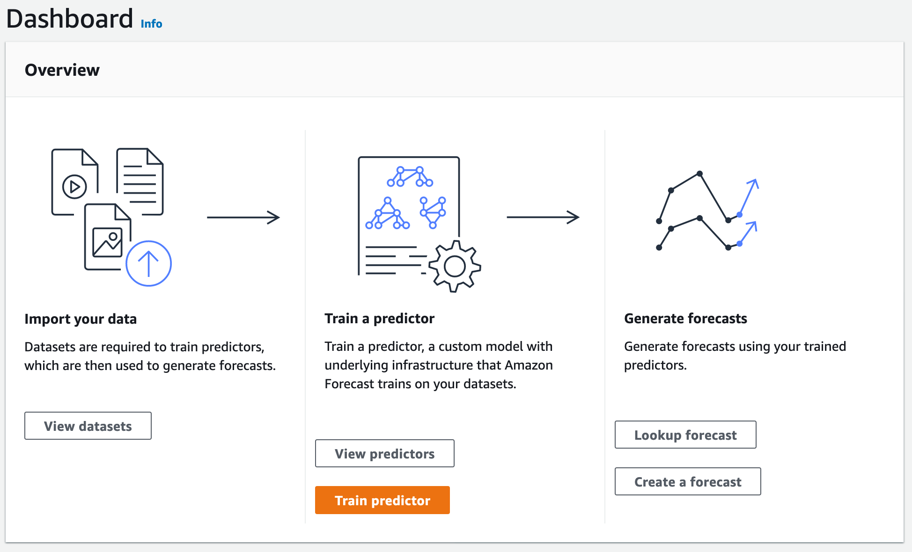
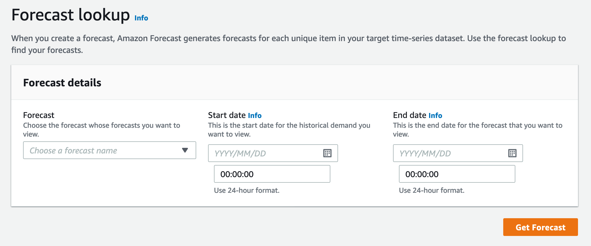
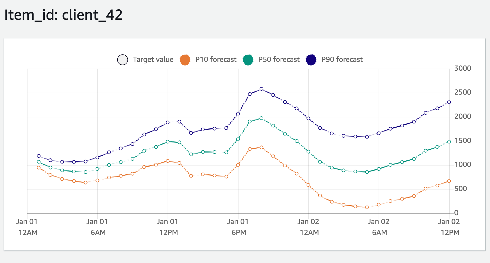

# 예측 검색하기

전 단계에서 예측 생성이 완료되고 나면 그 결과를 가져올 수 있습니다.
일종의 보고서를 출력해 보는 것입니다. 우선 다음의 화면을 현재 여러분께서는
마주하고 있을 것입니다, 아마도.



이전 화면까지 보이지 않았던, Lookup forecast 버튼이 가장 오른쪽 열 아래에서 두번째에
생겨났다는 것을 알 수 있습니다. 이제 우리는 이 버튼을 누르고 다음으로 진행합니다.  
이번에는 영롱한 오랜지色이 아닙니다 :-)

!!! note ""
    API 호출을 통하여 원하는 결과를 얻을 수도 있지만, 본 실습에서는
    console 웹 화면에서의 출력을 감상하는 것으로 만족하겠습니다.
    API 호출 같은 건 잘 모르겠지만, 지금 사용하고 있는 웹 브라우저의
    출력에 만족할 수 없다 --- 라고 생각하신다면, CSV 포멧으로 파일을 만들어
    엑셀 같은 소프트웨어에서 읽어 들인 다음, 능숙하게 멋진 그래프를 그려낼 수도 있습니다.

## 입력값 설명

한 가지를 선택하고 (Forecast), 두 가지 (Start date/time, End date/time)를 선언하면
에측(forecast)를 바로 조회할 수 있습니다. 직전 단계에서 만든 하나 밖에 없는 Forecast를
먼저 선택해 놓습니다. 그리고, Start date, End date을 생각해 봅시다.



### Start date과 End date

해당 화면에 출력되는 설명글은 이렇게 되어 있습니다.

> The date must be before the historical demand end date and 
    should be no earlier than the demand end date minus the forecast horizon.

윗글을 구글 번역기에 넣어 봤더니 아래와 같이 출력되었습니다.

> 날짜는 과거 수요 종료 날짜 이전이어야하며 수요 종료 날짜에서
    예측 기간을 뺀 것보다 빠르지 않아야 합니다.

위 문장으로 이해가 되었다면 다행이지만, 만약 약간의 주저함이 있다면 아래의 설명이 도움이 되길 바랍니다.

예측을 검색하기 위해서는 시작 일시(Start date/time)는 입력한 훈련 데이터 즉,
대상 시계열 데이터-셋의 시간 범위 밖에 있을 수 없고,
종료 일시(End date/time)는 앞서 예측기(predictor)를 훈련할 때 입력한
Forecast horizon * Forecast frequency 값을 초과할 수 없습니다.

본 실습에서 사용한 학습 데이터가 가지는 마지막 시각정보는 `2015-01-01 00:00:00`
이며, 우리는 36 시간을 내다 보는 설정을 예측기 훈련 때 선언했습니다.

학습 데이터가 가지고 있는 마지막 시각 기록은  

```bash
$ cat ./electricityusagedata.csv | cut -d ',' -f1 | sort | tail -1
2015-01-01 00:00:00
$ 
```

위의 예제와 같이 해당 데이터를 직접 봐[^1]도 되고, 훈련된 예측기(predictor)의 상세 정보에서
Test window end를 찾아보아도 알 수 있습니다. 우리는 단 한 번 Backtest를 수행했습다.

[^1]:  UNIX(-like)의 아름다움은 Pipeline에 있습니다.

그래서 아래와 같이 값을 넣었습니다.

* Start date/time: `2015/01/01 00:00:00`
* End date/time: `2015/01/02 12:00:00`
* Forecast key = item_id, Value = `client_42`

Forecast key는 어떤 아이템의 추세를 출력해 볼 것인가? 결정하는 것입니다.
우리가 사용한 학습 데이터에서는 client_0부터 client_369까지 총 370개의 item_id가
있습니다. 그 중 하나를 선택하면 되는 것입니다.

```bash
$ awk -F, '!seen[$3]++ {print $3}' ./electricityusagedata.csv
```

그래서 다음과 같은 화면이 되었습니다.

## 예측 검색 출력


그리고, `Get forecast`{style='background-color:#ef6c00; color:white'}을 누릅니다.
그러면 너무 빨라서 눈치채지도 못 할 순간에 바로 같은 화면 아랫쪽에 아래의 그림과 같은
그래프가 출력됩니다. 42번 고객(client_42)의 앞으로 36시간 동안의 전력 수요를 예측한 그림입니다.



해당 회면을 윗쪽으로 조금 스크롤해서 Value 입력 항에 `client_0` 에서 `client_369`까지 임의로 넣고,
`Get forecast`{style='background-color:#ef6c00; color:white'}를 눌러봅시다,
즉시 예측을 검색해서 출력받을 수 있습니다.

만약, 단일 item_id에 종속된 그래프 이외의 다른 것: 수치로 이루어진 결과(output) 그리고
다른 item_id들을 함께 조회하고 싶다면 다음의 방법을 사용하시면 됩니다.

### Create forecast export


본 실습을 진행하면서 언급하지 않았지만 여전히 존재했던 외쪽 메뉴에서 'Forecasts'를 선택합니다.
그리고 작성해 둔, 예측(forecast)를 선택하면 상단 메뉴 3개가 비활성화 상태에서 활성화로 변하는 것을
보실 수 있습니다. 그곳에서 영롱한 오랜지色 버튼, 'Create a forecast' 왼쪽에 위치한
`Create forecast export'를 선택합니다.


그리고 위 예시와 같이 필요 정보를 입력한 후 S3 버킷을 통하여 출력 데이터를 받을 수 있습니다.

'이름'만 정하면 나머지는 이전 단계에서 결정하거나 작성한 것입니다.
다만, S3 버킷은 새로이 폴더를 지정하여 export할 데이터가 다른 데이터와 혼재되는 것을
방지하는 것이 좋겠습니다. 본 예제와 같이 item_id가 많을 경우 그 모든 것에 대한
예측값을 출력하기 때문에 파일의 개수가 많아집니다.

`Create forecast export`{style='background-color:#ef6c00; color:white'}을
클릭하여 다음으로 진행합니다.


위 화면의 단계를 거쳐, 지정한 S3로 export가 완료되면 아래와 같이 Status가
녹색 'Active'로 나타는 것을 확인할 수 있습니다. 실패하면 적색 'Failed'가 나타나게 됩니다.


그럼, 지정한 S3 버킷으로 접근하여 export된 파일들을 확인할 수 있습니다.


`_CHECK`은 export를 시작하면서 지정한 위치가 정상적인지 확인한 결과를 남긴 것이며, `_SUCCESS`를
모든 작업을 완료한 직후에 생성하는 일종의 메타정보입니다. 우리는 뜻밖의 성과도 얻을 수 있는데,
이 모든 작업을 하는데 소요된 시간을 가늠할 수 있습니다. 뺄셈으로 말이죠. 이 경우에는 7분이 안 걸렸군요.

Export된 데이터 파일 중 하나를 다운로드 받아 `head` 명령으로 내용을 힐긋 보았습니다.
아래와 같더군요.

```bash
$ head ./redrabbitForecastExport_2020-06-08T17-53-31Z_part0.csv 
item_id,date,p10,p50,p90
client_254,2015-01-01T01:00:00Z,186.7223965486312,239.40948798705196,292.0965794254727
client_254,2015-01-01T02:00:00Z,161.88944380698803,232.04898970376885,302.2085356005497
client_254,2015-01-01T03:00:00Z,151.159001496469,235.2380272345243,319.31705297257963
client_254,2015-01-01T04:00:00Z,123.31023689077168,219.31377275262702,315.3173086144824
client_254,2015-01-01T05:00:00Z,113.53037978502726,220.13496893438523,326.7395580837432
client_254,2015-01-01T06:00:00Z,140.9919217226102,257.2367024345813,373.48148314655236
client_254,2015-01-01T07:00:00Z,301.78748840915097,426.93379855607157,552.0801087029922
client_254,2015-01-01T08:00:00Z,265.8582558697377,399.3152775555434,532.7722992413491
client_254,2015-01-01T09:00:00Z,372.90339999230287,514.1845768404129,655.4657536885229
$
```

긴 단계를 거쳐 마지막을 만났습니다. 여기에서 만족한다면 스스로 박수를 치고 지금까지 작성한 리소스를
삭제하여 더이상 과금이 안 되도록 조치한 후, 자리를 뜨시면 됩니다. 하지만, 궁금한 것이 여전히 남아 있고
그 궁금한 것이 지난 단계에서 다루지 않았거나 언급하지 않은 것이라면 다음 페이지로 진행하시면 좋겠습니다.

다음 페이지에서는 각 알고리즘을 선택한 예측기(predictor)가 어떻게 평가 받는지 알아 봅니다.
