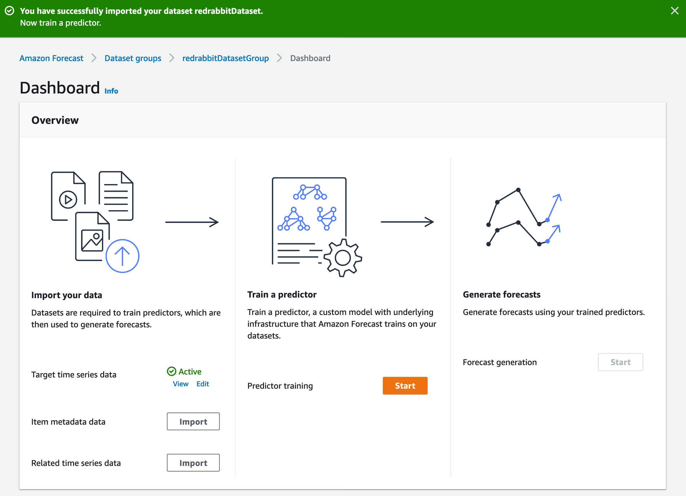
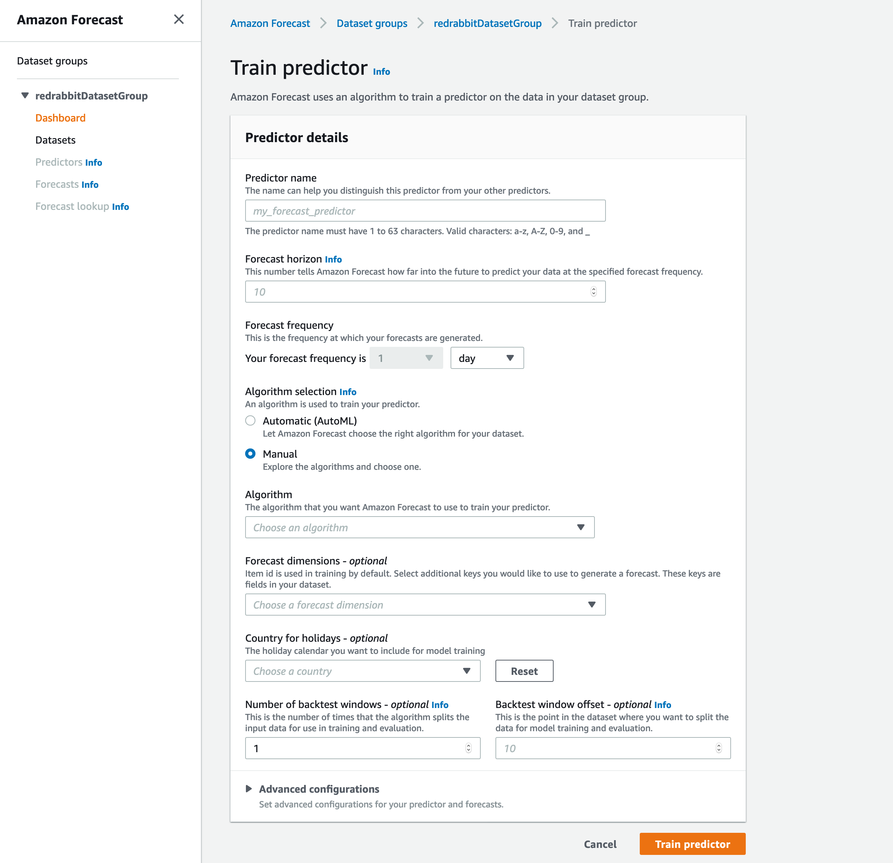
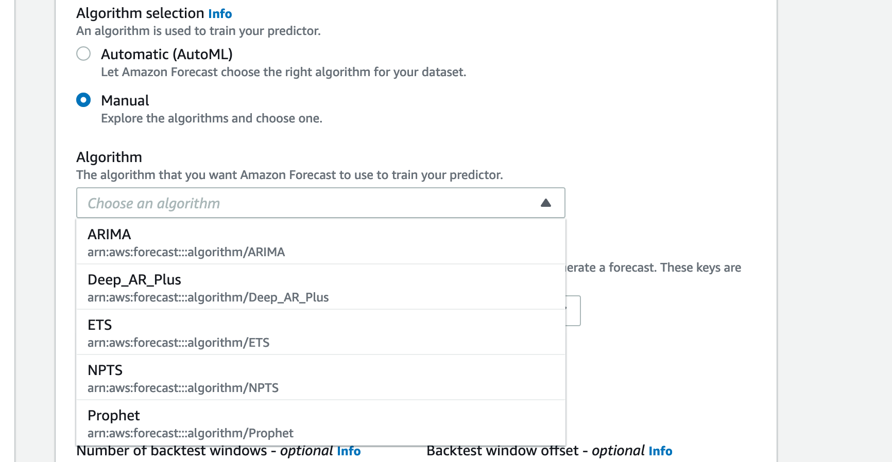

# 예측기 훈련

## 예측기 훈련 시작

대쉬보드에서 가운데 큰 아이콘 아래, Train a predictor에 해당되는 위치에 오랜지 색, 
`Start`{style='background-color:#ef6c00; color:white'}를
클릭해서 예측 훈련을 시작합니다.

화면이 아래와 같이 전환되고, 몇 가지 입력을 기다리고 있습니다. 어쩌면 전체 과정에서
가장 중요한 부분일 수도 있겠습니다. 여러가지 선택적 결정을 하기 때문입니다. 여러분께서는 지금
아래의 화면을 보고 계실 것입니다.

## 입력값 설명

### Forecast Horizon

기본값 10으로 시작되는 Forecast horizon은 예측기가 훈련을 통하여 얼마나 먼 미래를 내다 볼 것인가?
를 결정하는 것입니다. 이는 훈련에 사용하는 대상 시계열 데이터가 가진 시간 범위에 영향을 받습니다.
그럼, 10이라는 수(數)는 무엇을 의미하는가? 바로 다음에 입력할 값과 연관이 있습니다.

본 실습에서는 `36`을 입력합니다.

### Forecast frequency

대상 시계열 데이터를 입력할 때 지정한 값의 단위와 같습니다. 예측의 빈도를 말하는데, 1분에서 시작하여 1년까지 있습니다. 위의 Forecast horizon과 연계되어 계산됩니다.  
forecast horizon 값이 10을 가지고 forecast frequency가 1 day를 가진다면, 훈련할 예측기(predictor)가 예측(forecast)하는 미래는
10일 동안의 추세입니다.  
(한 번 더) forecast horizon이 값 5를 가지고 forecast frequency가 1 hour를 가진다면,
예측기가 예측하는 미래는 (데이터의 시계가 끝난 이후) 5시간이 됩니다.

Forecast horizon과 forecast frequency는 무한히 길게 설정할 수는 없습니다.
입력값, 대상 시계열 데이터이 가지고 있는 시간 범위와 연동됩니다, 당연히 그렇겠다고 예상할 수 있습니다.

본 실습에서는 `1 hour`을 선택합니다.  
결과적으로 36시간을 예측하는 의도입니다.

### Algorithm selection

알고리즘 선택에서는 Automatic(AutoML)과 Manual 두 가지가 있습니다.
Automatic은 최적이 알고리즘을 자동 선택해 주는 것인데, 이 방식은 보통의 예상과 다른 동작이 부가됩니다.

Amazon Forecast는 5가지 알고리즘들을 제공합니다. (아래에서 다시 설명)
그 모든 알고리즘들을 모두 사용해 보고 가장 적합하다고 판단되는 알고리즘의 결과를 선택해 줍니다.
그래서 시간이 **정말** 많이 걸립니다.
Automatic은 상당한 시간이 요구되지만, 자신의 데이터가 어떤 알고리즘과 맞을지 확신이 없을 때에는 매우 유용합니다.

만약, 자신이 어떤 알고리즘을 사용할지 확정할 수 있다면, Manual을 선택하고 바로 아래에 
나타나는 Algorithm의 pull down 메뉴에서 선택하면 됩니다.

알고리즘 선택의 고민에 대해서는 공식 개발자 안내서의 [Amazon Forecast 알고리즘 선택](https://docs.aws.amazon.com/ko_kr/forecast/latest/dg/aws-forecast-choosing-recipes.html)에서
친절한 설명을 하고 있습니다. AutoML을 넘어서는 정보를 스스로 갖추어야 겠다고 판단되시면
시간의 여유를 갖고 읽기를 권해 드립니다.

본 실습에서는 `ETS`를 선택합니다.  
우리가 선택한 예제는 전력 사용량입니다. ETS는 데이터와 관련된 계절성과 다른 주요 가정(일반적으로
예상할 수 있는)이 있을 경우 특히 유용합니다. 전력 사용량은 대체로 이러한 특성이 맞습니다.

### 기타 값

이번에 설명하는 값들은 모두 임의(optional) 선택할 수 있는 부분입니다.
그래도 둬도 대세에 지장이 없다는 의미도 됩니다.

**Forecast dimensions**는 입력 데이터에서 기준 열을 선택하는 것입니다.
우리는 3개의 열이 있는 데이터를 입력했고, 자연히 `item_id` 기준으로
수치의 변화를 보고 싶어 할 것입니다. 만약 `item_id`와 같이 기준 열을
대신할 값이 있다면 여기에서 선택할 수 있습니다.
아무런 입력이 없다면 `item_id`를 기준열로 선택됩니다.

**Country for holidays**는 각 국가별로 지정하고 있는 공유일을
모델을 훈련시키는데 활용하는 것입니다. 휴일에 따른 변동에 민감하게 예측이 변화되어야 한다면
여기에서 해당 국가를 선택할 수 있습니다.
우리나라는 Republic of Korea도 South Korea도 아닌, `Korea`라고 표시되어 있습니다.

**Number of backtest windows**는 훈련(trianing) 중 backtest를 수행할 횟수를
정하는 것입니다.

**Backtest window offset**는 앞선 Number of backtest window를 수행할 때
얼마만큼의 단위 많은 시계열 정보를 나누어서 다룰 것인가 결정하는 것입니다.

### Backtest

backtest는 단어에서 오는 느낌과 같이 뒤로 돌아가 테스트를 해 보는 것입니다.
이에 대한 상세한 설명은 공식 개발자 안내서의 [예측기 정확성 평가](https://docs.aws.amazon.com/ko_kr/forecast/latest/dg/metrics.html)에 있습니디만,
간단히 살펴보면
시계열 데이터 값을 가지고 훈련을 진행했을 때, backtest windows offset
단위로 number of backtest window 만큼 시계열 정보를 뒤에서부터 검증하는 것입니다.  
1시간 간격으로 이루어진 시계열 데이터 값을 가지고 훈련을 할 때
1의 값을 number of backtest window에서 가져가고, backtest windows offset이
36의 값을 가진다면, 1회에 한하여 시계열 데이터가 끝나는 시점에서 36시간 뒤로 돌아가
훈련한 값이 실제값과 얼마나 오차가 있는지 비교해 보는 것입니다.
이 값은 예측기의 정확도를 가늠하는데에 쓰입니다.

아래의 그림이 많은 부분의 이해를 돕습니다. 모두 공식 개발자 안내서의 그것을 가져 온 것입니다.

본 실습에서는 두 값에 변화를 주지 않습니다.
(이미 눈치를 챘겠지만)한 가지 알아두어야 할 것이 있는데, Backtest window offset 값은,
앞서 입력했던 Forecast Horizon 값을 반영합니다.

이제, 화면 가장 하단 우측에 위치한 `Train predictor`{style='background-color:#ef6c00; color:white'} 버튼을 클릭하여 훈련을 시작합니다.
