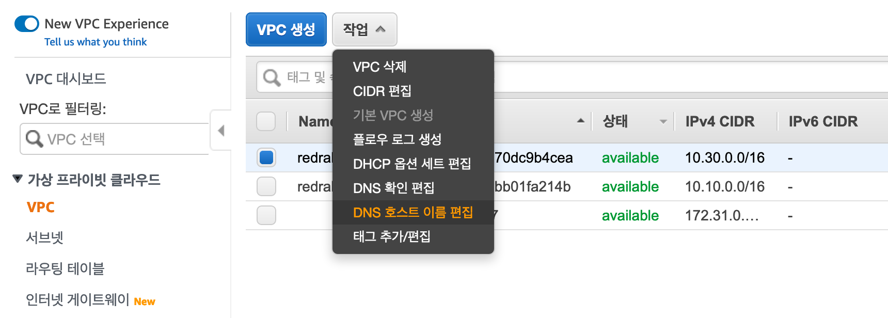
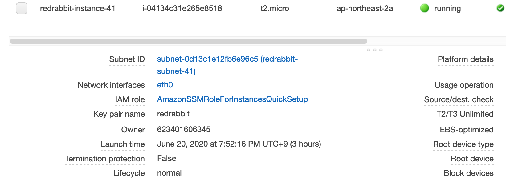

# 준비

실습을 위한 기초 환경을 만들어 놓습니다.  
짧지 않습니다. Buckle up!

## 사용자 환경

### 웹 브라우저

웹 브라우저만 잘 갇추었다면 만족할 수 있습니다.
Microsoft Edge, Firefox, Google Chrome이 적합하다고 할 수 있습니다.
즉, Gecko 엔진과 Chromium 엔진을 사용하는 웹 브라우저라면 좋습니다.

### CLI

추가적으로 command line interface가 있으면 더 좋을 수 있습니다.
하지만, 기본적으로 이번 실습 과정에서는 Web Console을 중심으로 놓고 설명을 합니다.
여러분께서 사용하고 있는 운영체제에서 CLI를 지원하고 그 CLI에 AWS CLI를 설치할 수 있으면
됩니다. 만약 그런 환경이 갖추어지지 않았다거나 굳이 그런 수고를 들이고 싶지 않는다면
AWS에서 제공하는 Cloud9을 사용하는 것을 추천합니다.
혹은, EC2 instance 하나를 만들고, session manager로 접속해서 사용하셔도 무관합니다.
모두 결국에는 같은 환경입니다.

## AWS 환경 구축

### IP (대역) 할당

VPC과 Subnet을 다음의 같이 미리 만들어 놓습니다.
서로 다른 리전에 VPC를 배치하며 각 VPC는 하나 혹은 두 개의 Subnet을 보유하게 됩니다.
각 리전에서 가용영역의 활용은 없습니다.

다음의 표는 각 구성이 가져가는 IP 관련된 정보입니다.  
목적은 각 VPC와 Subnet이 가지는 CIDR 영역이 겹치지 않게 하기 위함입니다.
이것은 예제일 뿐입니다. 각자가 더 창의적인 접근을 할 수 있으면 그것을 선택하시면 되겠습니다.

| Region             | VPC          | Subnet       | EC2 Instance | Additional Subnet|
|--------------------|--------------|--------------|--------------|--------|
| Region A (Ireland) | VPC 1        | Subnet 1-1   | Instance 1-1 |        |
|                    | 10.10.0.0/16 | 10.10.1.0/24 | 10.10.1.10   |        |
| Region A           | VPC 3        | Subnet 3-1   | Instance 3-1 |        |
|                    | 10.30.0.0/16 | 10.30.1.0/24 | 10.30.1.10   |        |
| Region B (Seoul)   | VPC 2        | Subnet 2-1   | Instance 2-1 | Subnet 2-2    |
|                    | 10.20.0.0/16 | 10.20.1.0/24 | 10.20.2.10   |10.20.2.0/24    |
| Region B           | VPC 4        | Subnet 4-1   | Instance 4-1 | |
|                    | 10.40.0.0/16 | 10.40.1.0/24 | 10.40.1.10   | |

위 정보를 기초로, 두 리전에 VPC들과 Subnet 그리고 EC2 Instances를 생성합니다.
생성이 완료되었다면, 이제 준비가 끝났습니다.

### VPC 및 Subnet 생성

위의 IP 할당표를 참조하여 각 리전에 VPC와 Subnet을 생성합니다.  
여러분께 VPC는 어떻게 만들고 Subnet은 왜 묵시적 라우팅이 가능한지 등에 대한 이야기를
다시 하는 건 매우 지루한 일이 될 것입니다.
다만, VPC를 생성하고 나서 하나의 옵션을 켜야 합니다.

#### DNS 호스트 이름

생성한 VPC를 선택하고, '작업' 메뉴에서 'DNS 호스트 이름 편집'을 선택해서
'DNS 호스트 이름'을 활성화 해야 합니다. 이는 Session Manager로 EC2 instance에 접속하기 위한
Systems Manager의 요구사항입니다.

### Private DNS 생성 (optional)

[엔드포인트 서비스의 프라이빗 DNS 이름](https://docs.aws.amazon.com/ko_kr/vpc/latest/userguide/verify-domains.html)

본 실습에서 이 부분은 다루지 않습니다. 하지만, 만약 이에 대한 관심이 있으시다면
위의 웹 링크로 안내하는, 공식 문서를 읽어보시는 것을 추천합니다.

### EC2 instances 생성

그리고, 필요한 EC2 instance들을 생성합니다. 본 예제에서는 Ubuntu 18.04 LTS로 일부 특징적인
예제가 있긴 하지만, 다른 Linux AMI를 선택하셔도 되고, Windows를 선택하셔도 무방합니다.

필요한 최소 instance의 수(數)는 총 넷입니다.  
만약 충분한 시간이 지금 있다면, VPC 4의 Subnet 4-1에 배포할 Instance 4-1, 단일 instance 대신
Auto scaling group으로 작성해 보신다면 보다 완벽한 실습이 되겠지만, 반드시 필요한 것은 아닙니다 :-)

EC2 instance를 만들면서 요구되는 Key를 미리 만들어 두든, instance 생성시 만들든 잘 보관해 둡시다.
서로 다른 VPC에 있는 instances 간의 접속 시험 때 사용할 수 있습니다.

### Systems Manager 설정

각 EC2 instance에 접근하기 위하여 다른 구성을 하지 않습니다.
다만, Systems Manager에서 제공하는 Session manager를 통하여 EC2 instance에 접근하고
여러 시도를 할 것입니다.

Systems Manager에서 '빠른 시작' 링크를 따라 들어가는 것만으로 보통의 세팅은 모두 끝나게 됩니다.
수 분에서 십 수 분 정도의 시간이 필요합니다.

Systems Manager는 리전에 종속됩니다. 우리는 두 개의 리전에 리소스를 배포하기 때문에
각 리전에서 공히 같은 작업을 해 주어야 합니다.

Systems Manager 설정은 필요한 EC2 instances를 모두 생성한 후에 진행하시는 것을 추천드립니다.
만약, 그 순서가 바르지 않는다면 - Systems Manager '빠른 시작'으로 구성 완료 후에 EC2 instance 생성 -
Systems Manager의 빠른 시작으로 다시 들어가서, 'Edit All'이라고 안내하는 영롱한 오렌지色의 버튼을
누른 뒤, 'Reset'을 누르시면 됩니다. 그러면, 다시 작업을 시작합니다.
참, 그리고 후에 생성한 EC2 instance가 IAM role로, `AmazonSSMRoleForInstancesQuickSetup`
혹은 그와 유사한 것이 할당 되었는지 반드시 확인해 보시기 바랍니다. (없으면 Session Manager로
접속할 수 없어요)

### VPC endpoint 작성

Systems Manager의 session manager를 통하여 EC2 instance에 접근하기 위하여
VPC에 endpoint를 작성합니다.
session manager로 EC2 instance에 접근하는 일반 방식은 대상이 되는 EC2 instance가
public subnet에 배치되어 있어야 합니다.
하지만, 본 실습의 구성에서는 그런 행운같은 설정은 존재하지 않기에, 우리는 VPC endpoint에
Systems Manager가 접근할 수 있도록 설정을 해 놓아야 합니다.

다음의 문서가 그 방법을 안내합니다.  
[How do I create VPC endpoints so that I can use Systems Manager to manage private EC2 instances without internet access?](https://aws.amazon.com/premiumsupport/knowledge-center/ec2-systems-manager-vpc-endpoints/)

앞선 단계를 차례로 따라 오셨다면, 위 링크에 있는 문서에서 안내하는 1부터 3번까지 단계를 생략하셔도 됩니다.

### Network Load Balancer 생성

VPC 4에 Network Load Balancer를 배치합니다. 해당 NLB는 비록 단 하나의 EC2 instance에
연결되지만, 우리의 시연에는 큰 문제가 없습니다.
다만, Target group에 대한 health check 시, 80이나 443
(우리는 지금의 환경에서 제대로된 웹 데몬을 항상 띄우지는 못 합니다)
포트가 아닌, 기본으로 오픈되어 있는 TCP 22번으로 설정하는 것이 필요합니다.

### NAT Gateway 생성

VPC 2의 Subnet 2-2에 해당 설정을 합니다.

### Internet Gateway 생성

VPC 2에 해당 설정을 합니다.

### 라우팅 테이블

지금은 따로 설정하지 않습니다.

#### Public Subnet, Subnet 2-2

VPC 2에 라우팅 테이블을 만들어 줍니다. 이 라우팅 테이블은, 0.0.0.0/0로 가는 길에 Internet gateway가 지정됩니다.
그리고 이 라우팅 테이블은, Subnet 2-2에 지정합니다.

#### Private Subnet, Subnet 2-1

VPC 2에 라우팅 테이블을 만들어 줍니다. 이 라우팅 테이블은, 0.0.0.0/0로 가는 길에 NAT gateway가 지정됩니다.
그리고 이 라우팅 테이블은, Subnet 2-1에 지정합니다.

### 보안 그룹

보안 그룹(Security Group)은 모두 열어 둡니다.

| Type 유형 | Protocol 프로토콜 | Port range 포트 범위 | Source 소스 | |
|------|----------|------------|--------|---|
|All traffic 모든 트래픽 | All 전체 | All 전체 | Custom 사용자 지정 | 0.0.0.0/0 |

`Custom 사용자 지정` 대신 `Anywhere 위치 무관`을 선택할 수도 있습니다.  
본 실습의 목표는 보안에 관한 조정이 포함되어 있지 않습니다.
