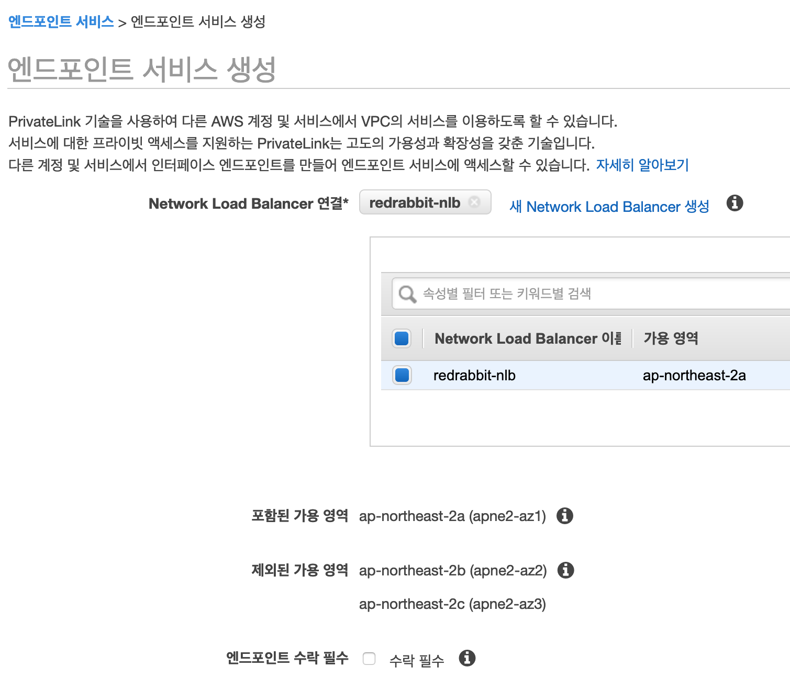
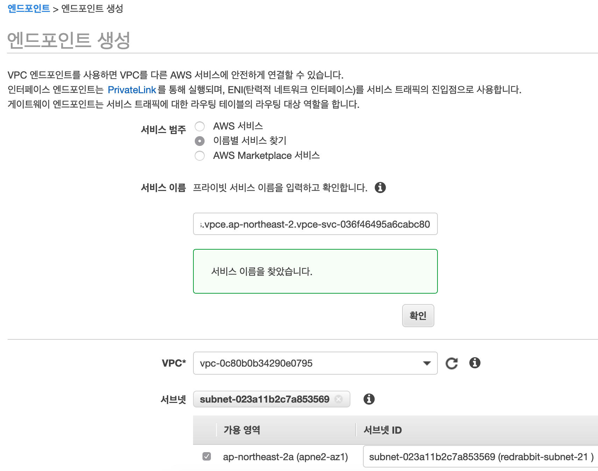
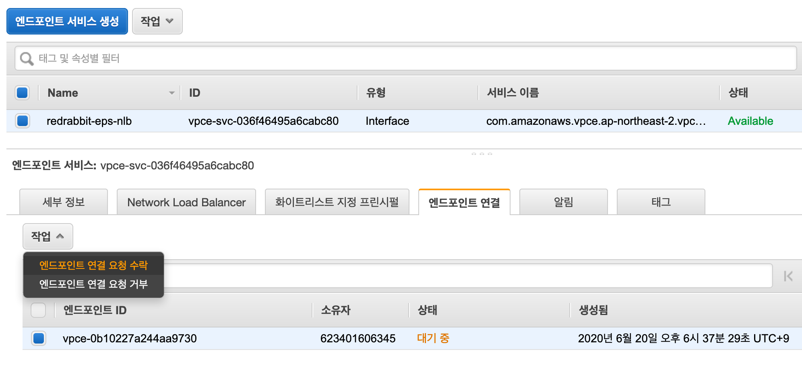

# 실습

## PrivateLink 생성

준비 단계에서 생성한 EC2 instance과 Network Load Balancer(이하, NLB)를 사용합니다.

**VPC > 가상 프라이빗 클라우드 - 엔드포인스 서비스**를 선택해서 들어갑니다.
그리고 화면 상단의 `엔드포인트 서비스 생성`{style='background-color:dodgerblue; color:white'}
을 클릭하여 엔드포인트를 생성합니다.
그리고 화면의 안내에 따라, 준비 단계에서 미리 생성해 둔 NLB를 선택합니다.



기본으로 지정되어 있는, '엔드포인트 수락 필수' 항목은 선택하지 않습니다.
요청과 수락을 모두 본인이 하는 시나리오이면, 이 항목은 유용하지 않습니다.

위 단계를 완료하면 다음의 화면 만나게 됩니다.


## VPC endpoint 생성

제일 먼저, 직전에 생성한 VPC endpoint services의 '**서비스 이름**'을 클립보드에 복사해 둡니다.


이제 엔드포인트 서비스(endpoint service)에서 나와, 엔드포인트(endpoints)로 갑니다.
둘 모두, **VPC > 가상 프라이빗 클라우드 - 엔드포인트**에 있습니다.

준비 단계에서 Systems Manager 설정을 위해 방문했던 그 곳입니다.

`엔드포인트 생성`{style='background-color:dodgerblue; color:white'}을 누르고,
나타나는 아래와 같은 화면에 '서비스 범주'는 '**이름별 서비스 찾기**'를 세가지 중에
라디오 버튼을 눌러 선택합니다.
'클립보드에 복사' 해 두었던 '엔드포인트 서비스'의 서비스 이름을 '**서비스 이름**'란에
붙혀 넣기 합니다. 만약 입력한 값이 유효하지 않으면, 아래 화면과 같이 녹색의 긍정적인
메시지가 아니라, 적색 경고 메시지가 나타납니다.

그리고 이 엔드포인트를 유치할 VPC와 Subnet을 확정합니다.  
아래에서 보는 것과 같이 **VPC 2**의 **Subnet 2-1**입니다.



조금 전 생성한 엔드포인트는 여전히 '상태'는 '대기 중'으로 유지될 것입니다.
반대편 VPC에서 요청을 '수락'하지 않으면 말이죠.


그리고, 요청을 처리하기 위해 **VPC 4**에서 peering을 수락합니다.  
아래의 화면과 같은 단계를 따라갈 수 있습니다.

<!--

-->




위 화면과 같이 최종적으로 `예, 수락`{style='background-color:dodgerblue; color:white;'}을
누르시면 상대편 VPC에서 할 일은 완료되게 됩니다.

잠깐의 시간이 흐른 뒤에 아래와 같이 '상태'가 '**Available**'로 변경되는 것을 확인할 수 있습니다.
사용자도 할 일을 끝내고, 시스템도 할 일을 모두 끝낸 시점입니다.


이제 VPC 2에 배포되어 있는 instance 2-1로 접속해서 (session manager를 통해서)
마지막에 생성한 VPC endpoint로 웹 접속을 해 봅니다. VPC endpoint의 주소는 아래의 그림과 같이
해당 endpoint의 '세부 정보'의 'DNS 이름'[^1]으로 알 수 있습니다. 

[^1]: 'DNS 이름'이라는 명칭은 혼란을
    줄 수 있다는 생각인데, FQDN(Full Quantified Domain Name)이 맞지 않나 싶습니다.
    엄밀히 말해서 DNS 이름은, Domain Name Server(Service)의 이름으로, DNS-01, NS-WEST-BAY17
    뭐 이런 식이어야 할 듯 합니다.


VPC4에 있는 instance 4-1에 접속해서, 간단한 HTML 파일을 만들어 둡니다.
plain text 문서를 index.html로 작성해 두어도 아무런 문제가 되지 않습니다.

현재 해당 EC2 instance는 외부와의 접속이 되지 않습니다. private subnet에
위치해 있고, 다른 연결 방식은 없습니다. 따라서 웹 서버를 설치하기가 용이하지 않습니다.
그리하여, 기본으로 설치되어 있는 python의 기능 하나를 활용하기로 합니다.

아래의 내용은, python으로 간단 웹 데몬을 하나 동작시키는 것입니다.
반드시 index.html이 있는 디렉토리에서 명령 내려야 합니다.

```bash
$ sudo su - ubuntu
ubuntu@ip-10-40-1-10:~$ cd web
ubuntu@ip-10-40-1-10:~/web$ cat ./index.html
<html>
        <head><title>Test from Instance 4-1</title></head>
        <body>
                Hello World; this is Instance 4-1

        </body>
</html>
ubuntu@ip-10-40-1-10:~/web$ sudo python3 -m http.server 80
Serving HTTP on 0.0.0.0 port 80 (http://0.0.0.0:80/) ...
```

이제 세션 메니저로 VPC 2에 배포해 둔, Instance 2-1에 접속합니다.
그리고 VPC 2에 만들어 놓은 그리고 VPC 4의 NLB를 품고 있는 VPC Endpoint Service와
연결해 둔, VPC endpoint의 주소로 `curl` 명령을 내려 모든 것이 제대로 동작하는지
확인합니다.

문제가 없다는 아래의 예와 같이 화면 출력을 보실 수 있습니다.

```bash
$ sudo su - ubuntu
To run a command as administrator (user "root"), use "sudo <command>".
See "man sudo_root" for details.

ubuntu@ip-10-20-1-37:~$ curl vpce-0b10227a244aa9730-dybhspou.vpce-svc-036f46495a6cabc80.ap-northeast-2.vpce.amazonaws.com
<html>
        <head><title>Test from Instance 4-1</title></head>
        <body>
                Hello World; this is Instance 4-1

        </body>
</html>
ubuntu@ip-10-20-1-37:~$ 
```
instance 4-1에 작동시켜 놓은 python 웹 데몬에서 아래와 같이 접속이 이루어졌음을 확인할 수 있습니다.

```bash
$ sudo su - ubuntu
ubuntu@ip-10-40-1-10:~$ cd web
ubuntu@ip-10-40-1-10:~/web$ cat ./index.html
<html>
        <head><title>Test from Instance 4-1</title></head>
        <body>
                Hello World; this is Instance 4-1

        </body>
</html>
ubuntu@ip-10-40-1-10:~/web$ sudo python3 -m http.server 80
Serving HTTP on 0.0.0.0 port 80 (http://0.0.0.0:80/) ...
10.40.1.80 - - [20/Jun/2020 11:31:05] "GET / HTTP/1.1" 200 -
10.40.1.80 - - [20/Jun/2020 11:31:28] "GET / HTTP/1.1" 200 -
10.40.1.80 - - [20/Jun/2020 11:31:53] "GET / HTTP/1.1" 200 -
```

