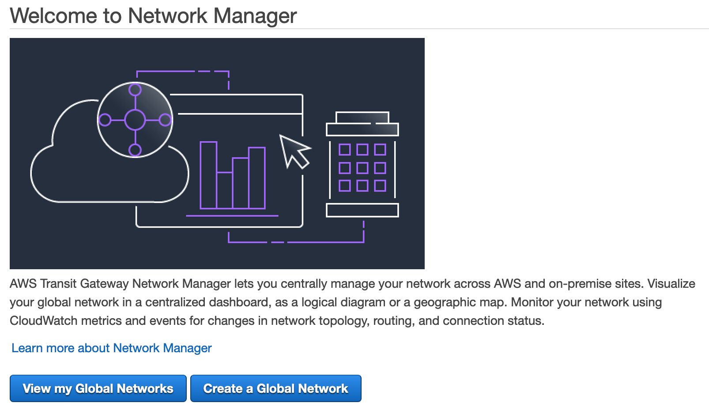
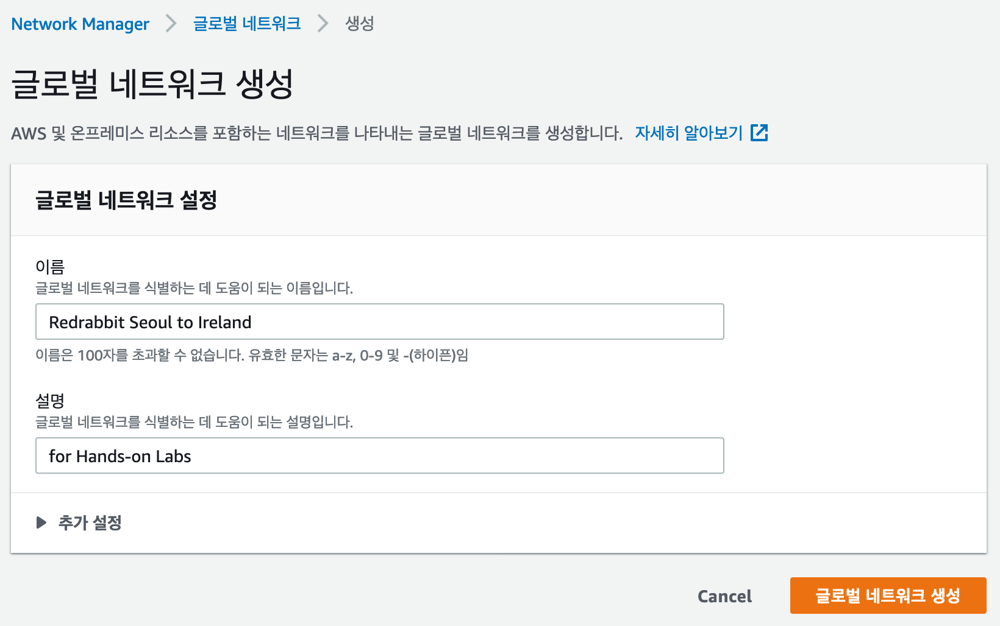
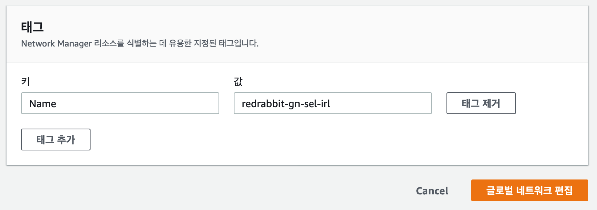
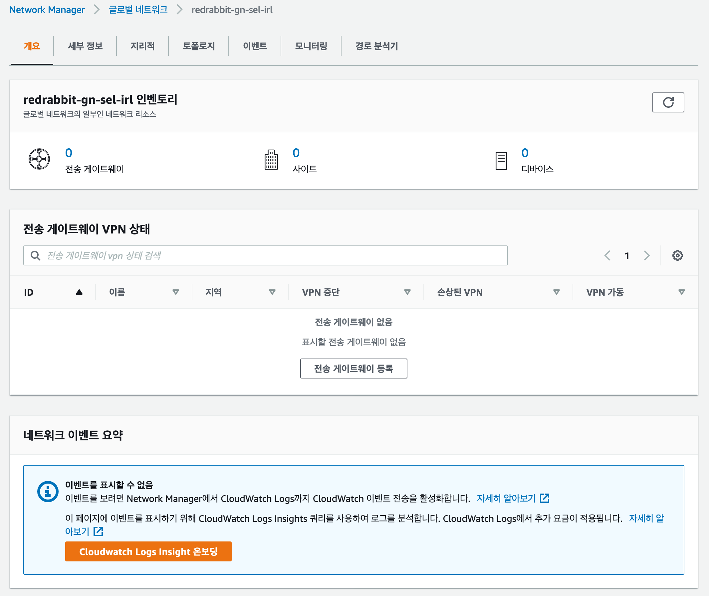
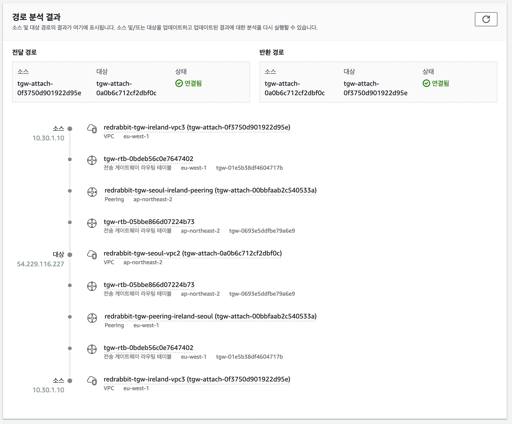

# Network Manager

## 간단 소개

Transit Gateway Network Manager는 transit gateway로 연결된 이런저런 구성요소들을
멋지다고 생각할 수도 있는 그래픽 환경에서 보는 것입니다. 네, 보는 것입니다. 그래서 제어는
안 됩니다, 당연히도 말이죠.

전 시대에 모든 전산실을 점령해 버렸던 이러저러하던
[NMS](https://en.wikipedia.org/wiki/Network_monitoring)를 연상시킵니다.
연상만 시킵니다. 다른 건 안 합니다.

## 만들어 보십시다

명칭에서 약간 뒷걸음치게 하는 'Global Network'을 만들어야 합니다.
서울 리전에 있는 VPC 두 개를 tgw로 묶어도 Global Network입니다.
`Create Global Network`을 누릅시다.  

### Create Global Network

만약 Transit gateway network manager에 대해 심층적으로 다소 학구적으로
접근하고 싶으면, 저 푸른 버튼으로 마우스 포인터를 옮기기 전에,
[Learn more about Network Manager](https://docs.aws.amazon.com/vpc/latest/userguide/what-is-network-manager.html)를 클릭하여 조금의 시간을 들여 읽어 보시는 것을
추천합니다. 

Transit gateway와 그것에 부가된 여러 기능들은 아직 console에서 한국어로
번역이 안 되어 있는데, 신기하게도 설명서들은 번역 되어 있습니다.
약간 난해한 미-남가주지역 사투리로 적혀 있는 것이 흠이긴 하지만, 우리는 다년간의
노력으로 전세계에 만연되어 있는 그 방언에 익숙해져 있지 않겠습니까.

다시 돌아가서, 이제 정말 `Create Global Network`{style='background-color:dodgerblue; color:white'}을 누릅시다.

놀랍게도 여기에는 한국어로 번역되어 있습니다. 즐겁게 작업할 수 있을 것만 같습니다.
'이름'과 '설명'을 입력합니다. 여러개를 만든다면 식별을 이것으로 하게 될 것 같습니다.

'설명'란에 한국어를 입력하면 오류가 생깁니다. 제한 조건에 대한 선언이 없어 당황했다면
눈치챙겨서 '이름'란의 조건을 그대로 가져오면 괜찮을 듯 합니다.

그리고, 눈치를 잘 챙겨도 이유없이 network manager는 생성되지 않고 뭘 잘 못 입력했다고
경고하는 수도 있으니 당황하지는 맙시다.

'글로벌 네트워크 설정'에서 '추가 설명'을 누르면 Tag를 적을 수 있는 익숙한 창이 나옵니다.
그곳에 입력한 Key:Value가 Name:redrabbit-gn-sel-irl였고, '이름'도 같은 것을
적으니 위 그림과 같은 오류가 났습니다. 이 두 개의 값은 사실 하나의 값, Name 키에 넣는
Value를 물어보는 것이 상단 입력란 '이름'입니다.

이 오류를 회피하기 위해 '추가 설정'에서 태그 정보를 삭제했습니다.
글로벌 네트워크 생성 후에, Network Manager > 글로벌 네트워크 > '이름' > 세부 정보, 로 가서
'태그 편집'하면 얼마든지 자유롭게 변경할 수 있습니다.

이 번 단계에서는 '이름'을 태그를 입력하는 것과 같은 마음 가짐으로 입력하며,
'설명'란에는 영문으로만 작성하고 `글로벌 네트워크 생성`{style='background-color:darkorange; color:white'}을 클릭합시다.

서비스는 사용자의 애정을 바탕으로 시간을 먹으며 성장해 나아갑니다.
우리가 즐겨 찾는 '치킨'들처럼 완전한 성인이 되기도 전에 용도를 끝내는
경우가 더 많기는 하지만, 아무튼 서비스가 제대로 모습을 갖출 때까지 '시간'은 필요한 법이죠.

### Transit Gateway 등록

`글로벌 네트워크 생성`을 막 클릭하고 문제가 없었다면, 아래의 화면을 만나게 됩니다.

지금까지의 여정을 잠시 생각해 보면, 이 단계에서 우리가 할 수 있는 일은
'전송 게이트웨이 등록'으로 안내되어 있는 버튼을 가볍게 클릭하는 것 이외에는 없다는 것을 알게 됩니다.

친절하게 사용자가 소유한 모든 transit gateway를 다 보여는 주는 것 같습니다. 모두 선택하고
우측 하단을 보시면, 회색이었던 `전송 게이트웨이 등록`이 주황색 `전송 게이트웨이 등록`{style='background-color:darkorange; color:white'}으로 변한 것을 알 수 있습니다.
그렇습니다. 자신을 눌러 달라는 호소입니다. 눌러 주도록 하십시다.

그럼 transit gateways의 상태가 pending을 거쳐, available 녹색 글자로 나타나게 됩니다.
transit gateway에 영향을 줘서 transit gateway 자체가 왔다 갔다 하는 건 아닙니다.
'글로벌 네트워크'에서 이 transit gateways를 어떻게 생각하느냐?에 대한 상태입니다.

### 완료

현재 본 실습 단계에서 network manager를 활용해 보기 위해서 할 수 있는 설정은 transit gateways를
등록하는 것 이외에는 더 없습니다. 우리가 가진 환경에서 network manager를 활용했을 때 가장
흥미롭게 지켜 본 것은, '경로 분석기 Route Analyzer'가 일해 주는 '경로 분석'이었습니다.
경로 분석의 결과 하나를 아래에 남깁니다.

