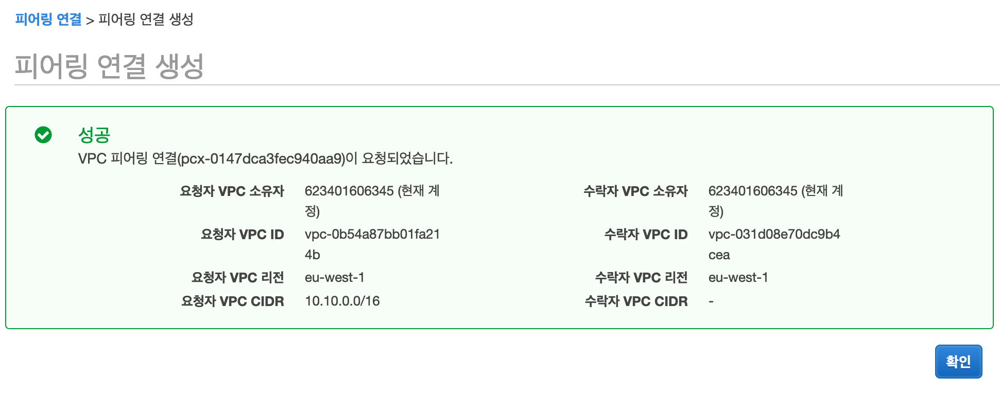
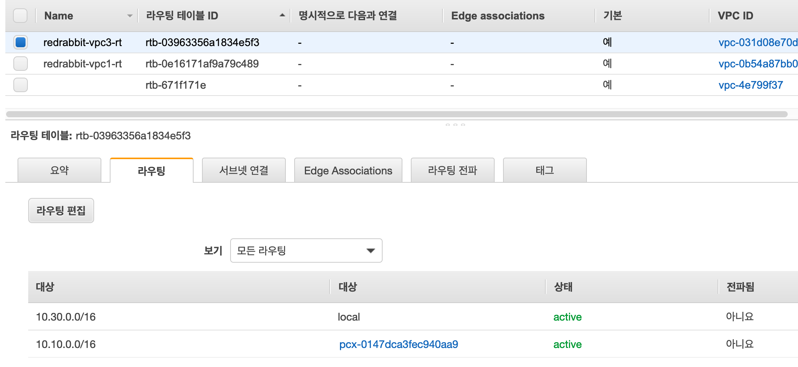

# 실습

VPC peering은 '준비' 단계에서 생성해 놓은 아일랜드 리전의 두 VPC를 사용할 것입니다.
VPC 1과 VPC 3입니다. 아래의 그림에서는 Region A에 속하며 우측에 해당되는 영역입니다.


## 연결 설정

VPC peering에는 요청자(requester)와 수락자(accepter)로 역할이 나뉩니다.  
VPC 1이 요청자가 되고, VPC 3이 수락자가 됩니다.

### 연결 요청





### 연결 수락


#### 연결 상태 확인


## 기타 설정 및 확인

라우팅 테이블과 보안 그룹(security group)의 조정은 상식 선에서 진행하면 되겠습니다.
VPC 1의 inbound는 VPC 3에 한정하는 설정을 가져 갑니다.

### 라우팅 테이블 설정




#### 라우팅 테이블 설정 결과


#### 서브넷 연결 편집


### 보안 그룹 설정


### 연결 확인

instance 1-1과 instance 3-1은 서로 자유롭게 통신할 수 있게 설정했습니다.
우리가 익히 잘 알고 있는 `ping` 명령으로 상호 응답을 하는지 확인하겠습니다.

세션 메니저로 각 instance에 연결하여 다음과 같이 확인해 봅시다.

```bash
ubuntu@ip-10-10-1-10:~$ ping 10.30.1.10 -c 3
PING 10.30.1.10 (10.30.1.10) 56(84) bytes of data.
64 bytes from 10.30.1.10: icmp_seq=1 ttl=64 time=0.430 ms
64 bytes from 10.30.1.10: icmp_seq=2 ttl=64 time=0.514 ms
64 bytes from 10.30.1.10: icmp_seq=3 ttl=64 time=0.502 ms

--- 10.30.1.10 ping statistics ---
3 packets transmitted, 3 received, 0% packet loss, time 2025ms
rtt min/avg/max/mdev = 0.430/0.482/0.514/0.037 ms
ubuntu@ip-10-10-1-10:~$
```

```bash
ubuntu@ip-10-30-1-10:~$ ping 10.10.1.10 -c 3
PING 10.10.1.10 (10.10.1.10) 56(84) bytes of data.
64 bytes from 10.10.1.10: icmp_seq=1 ttl=64 time=0.373 ms
64 bytes from 10.10.1.10: icmp_seq=2 ttl=64 time=0.436 ms
64 bytes from 10.10.1.10: icmp_seq=3 ttl=64 time=0.499 ms

--- 10.10.1.10 ping statistics ---
3 packets transmitted, 3 received, 0% packet loss, time 2054ms
rtt min/avg/max/mdev = 0.373/0.436/0.499/0.051 ms
ubuntu@ip-10-30-1-10:~$
```